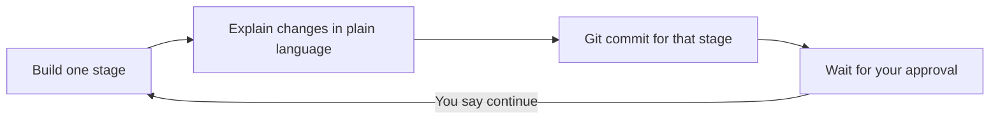

# Step-by-Step Portfolio Build (Revised)

## What changed from the original plan
- **No dark mode** — no theme toggle, no `data-theme`, no `useTheme` hook, no dark SCSS variables
- **Incremental delivery** — one focused stage at a time, not a single big dump
- **Git at every stage** — each stage ends with a commit so you can see exactly what changed and when
- **Your approval gate** — after each stage I explain what was done; you review and say when to continue

## How we will work together



**At the end of every stage I will:**
1. Summarize what files were created/changed and why
2. Tell you how to run/verify (`npm run dev`)
3. Create a Git commit with a clear message
4. Ask: *"Ready for Stage N+1?"*

**You control the pace** — reply "continue", "yes", or ask questions/changes before we move on.

---

## Stage 1 — Project foundation
**Goal:** A minimal working React + Vite app with SCSS wired up.

**What gets created:**
- [`package.json`](package.json) — React, Vite, Sass dependencies
- [`vite.config.js`](vite.config.js) — Vite + React plugin
- [`index.html`](index.html) — HTML shell
- [`src/main.jsx`](src/main.jsx) — React entry point
- [`src/App.jsx`](src/App.jsx) — placeholder: "Adi Sabban Portfolio"
- [`src/styles/global.scss`](src/styles/global.scss) — minimal reset only
- [`.gitignore`](.gitignore)

**Git commit:** `chore: initialize Vite + React + SCSS project`

**You verify:** `npm install` then `npm run dev` — browser shows a simple placeholder page.

---

## Stage 2 — Design system (light theme only)
**Goal:** Establish colors, typography, spacing, and layout primitives — one consistent light look.

**What gets created:**
- [`src/styles/variables.scss`](src/styles/variables.scss) — CSS custom properties (colors, radii, shadows, container width)
- [`src/styles/layout.scss`](src/styles/layout.scss) — `.container`, `.section`, responsive spacing
- [`src/styles/components.scss`](src/styles/components.scss) — buttons, pills (started empty or minimal)
- Update [`src/styles/global.scss`](src/styles/global.scss) to `@use` the partials

**Removed vs old plan:** No `[data-theme='dark']` block, no theme toggle styles.

**Git commit:** `style: add light-theme SCSS design system`

**You verify:** Page has a clean background, readable typography, and a centered container.

---

## Stage 3 — Header + Hero
**Goal:** Top navigation and intro section — the first real UI.

**What gets created:**
- [`src/components/Header.jsx`](src/components/Header.jsx) — logo, nav links (About, Projects, Case studies), "Jump to" dropdown (empty for now)
- [`src/components/Hero.jsx`](src/components/Hero.jsx) — name, short bio, CTA buttons
- SCSS for header and hero in [`src/styles/components.scss`](src/styles/components.scss) and [`src/styles/layout.scss`](src/styles/layout.scss)
- Wire into [`src/App.jsx`](src/App.jsx)

**Git commit:** `feat: add header and hero sections`

**You verify:** Sticky header, hero with your name and "View projects" link that scrolls to `#projects`.

---

## Stage 4 — Project data
**Goal:** All four projects as structured JS data (your template content, verbatim).

**What gets created:**
- [`src/data/projects.js`](src/data/projects.js) — Minesweeper, Meme Generator, KeepMailRead, Abnb

Each project object holds: identity, inventory, asset prep, positioning fields — exactly from your Cursor summaries. GitHub/live links stay `null` until you provide them.

**Git commit:** `data: add structured project content for four case studies`

**You verify:** Temporarily log `projects` in `App.jsx` or inspect in React DevTools — no UI change yet.

---

## Stage 5 — Project cards grid
**Goal:** Visual project overview before the deep case studies.

**What gets created:**
- [`src/components/ProjectCard.jsx`](src/components/ProjectCard.jsx) — title, pitch, top skill tags, collaboration badge, link to case study anchor
- [`src/components/Pill.jsx`](src/components/Pill.jsx) — small tag component
- Projects section in [`src/App.jsx`](src/App.jsx) with responsive grid

**Git commit:** `feat: add project cards grid`

**You verify:** Four cards render; "View case study" scrolls to the matching `#slug` (sections may not exist yet).

---

## Stage 6 — Case studies with accordions
**Goal:** Detailed per-project breakdown in your 4-part template, kept uncluttered via accordions.

**What gets created:**
- [`src/components/TemplateAccordion.jsx`](src/components/TemplateAccordion.jsx) — expandable sections 1–4
- [`src/components/CaseStudy.jsx`](src/components/CaseStudy.jsx) — renders Identity, Inventory, Asset Prep, Positioning from data
- Case studies section in [`src/App.jsx`](src/App.jsx)
- Populate "Jump to" dropdown in Header with project links

**Git commit:** `feat: add case study sections with template accordions`

**You verify:** Each project expands to show all four template sections with your original content.

---

## Stage 7 — Footer + polish
**Goal:** Finish the page and small UX touches.

**What gets created:**
- [`src/components/Footer.jsx`](src/components/Footer.jsx)
- Smooth scroll (`scroll-behavior: smooth` in global styles)
- Hover/focus states on cards and buttons
- Mobile responsive tweaks (header nav, hero stack, card grid)
- Disabled placeholder buttons for GitHub/Live demo (until you add URLs)
- [`public/favicon.svg`](public/favicon.svg)

**Git commit:** `feat: add footer and responsive polish`

**You verify:** Full page works on desktop and mobile; no dark mode anywhere.

---

## Final file structure (after all stages)

```
adi-sabban-portfolio/
├── index.html
├── package.json
├── vite.config.js
├── public/favicon.svg
└── src/
    ├── main.jsx
    ├── App.jsx
    ├── data/projects.js
    ├── components/
    │   ├── Header.jsx
    │   ├── Hero.jsx
    │   ├── ProjectCard.jsx
    │   ├── CaseStudy.jsx
    │   ├── TemplateAccordion.jsx
    │   ├── Pill.jsx
    │   └── Footer.jsx
    └── styles/
        ├── global.scss
        ├── variables.scss
        ├── layout.scss
        └── components.scss
```

---

## Stack (unchanged)
- React + Vite
- Custom SCSS (no Tailwind, no Next.js)
- Single-page layout with anchor navigation (no React Router needed)

## When you're ready
Reply **"Start Stage 1"** and I will:
1. Scaffold only Stage 1 files
2. Explain every file in plain language
3. Commit to Git
4. Wait for your go-ahead before Stage 2
